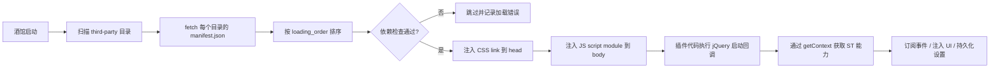

# 酒馆（SillyTavern）扩展机制总结

> 目标：搞清楚「第三方插件是怎样被酒馆读取使用的」，为开发新插件提供通用参考。
> 结论基于对酒馆核心源码（`public/scripts/extensions.js`）的验证。

---

## 1. 整体流程（一句话版）

酒馆启动时扫描 `public/scripts/extensions/third-party/` 下的所有子目录 → 逐个 `fetch` 每个目录的 `manifest.json` → 按 `loading_order` 排序 → 逐个把 `manifest.js` 指定的文件作为 **ES Module `<script>` 注入页面**、把 `manifest.css` 作为 `<link>` 注入 `<head>` → 插件代码执行时通过 `SillyTavern.getContext()` 获取上下文、通过 `ctx.eventSource` 订阅事件、通过 `ctx.extensionSettings` 读写自己的配置。



---

## 2. 目录约定与 manifest.json

### 2.1 目录位置

第三方扩展放在酒馆的：

```
public/scripts/extensions/third-party/<扩展目录名>/
```

### 2.2 manifest.json 字段

| 字段                                 | 用途                                     | 是否必填           |
| ------------------------------------ | ---------------------------------------- | ------------------ |
| `display_name`                       | 扩展管理界面显示的名称                   | 建议               |
| `loading_order`                      | 加载顺序（数字，小者先加载）             | 建议               |
| `js`                                 | 入口 JS 文件（相对扩展目录）             | 是（无 JS 可不填） |
| `css`                                | 样式文件（相对扩展目录）                 | 否                 |
| `requires`                           | 要求的 Extras 模块列表（不满足则不加载） | 否                 |
| `optional`                           | 可选模块（仅展示，不阻断加载）           | 否                 |
| `dependencies`                       | 依赖的其他扩展目录名（不满足则不加载）   | 否                 |
| `minimum_client_version`             | 最低酒馆客户端版本（不满足则不加载）     | 否                 |
| `author` / `version` / `description` | 元信息，显示在扩展管理面板               | 建议               |
| `auto_update`                        | 是否自动更新（第三方扩展用）             | 否                 |
| `i18n`                               | 本地化文件映射（可选）                   | 否                 |

### 2.3 加载顺序细节

酒馆源码 [`extensions.js`](../../../extensions.js:49)：

```js
const sortManifestsByOrder = (a, b) =>
    parseInt(a.loading_order) - parseInt(b.loading_order) ||
    String(a.display_name).localeCompare(String(b.display_name));
```

即：**先按 `loading_order` 数字升序，相同时按 `display_name` 字母序**。

---

## 3. 加载流程详解（酒馆侧 [`extensions.js`](../../../extensions.js)）

### 3.1 扫描与读取 manifest

- 酒馆把第三方扩展统一标记为 `third-party/<目录名>` 的内部 key（如 `third-party/My-Extension`）。
- `getManifests()` 对每个扩展 `fetch('/scripts/extensions/<name>/manifest.json')` 并解析 JSON。

### 3.2 激活检查（`activateExtensions()`）

对每个扩展依次检查，全部通过才加载：

1. **`minimum_client_version`**：版本比较。
2. **`requires`**：要求的 Extras 模块是否都存在。
3. **`dependencies`**：依赖的扩展是否存在且未被禁用。
4. **`disabledExtensions`**：用户在扩展面板禁用列表里的不加载。

任何一项不满足 → 跳过 + 把错误消息写入 `extensionLoadErrors`，在扩展面板显示红色 warning。

### 3.3 注入脚本与样式

通过后执行：

```js
addExtensionLocale(name, manifest).finally(() =>
    Promise.all([addExtensionScript(name, manifest), addExtensionStyle(name, manifest)])
);
```

- **JS**（`addExtensionScript()`）：创建 `<script type="module" src="/scripts/extensions/<name>/<manifest.js>" async>`，**append 到 `document.body`**。
  - ⚠️ 关键：`type="module"` —— 插件 JS 是 **ES Module**，可以 `import` 其他文件（多文件插件靠它）。
  - `async`：异步加载，不与页面主流程阻塞。
  - 脚本 `id` 为 `sanitizeSelector("<name>-js")`。
- **CSS**（`addExtensionStyle()`）：创建 `<link rel="stylesheet" href="/scripts/extensions/<name>/<manifest.css>">`，append 到 `document.head`。
  - `id` 为 `<name>-css`。
- 加载成功后才把扩展加入 `activeExtensions`，并调用 `callExtensionHook(name, 'activate')`。

### 3.4 生命周期 Hook

酒馆支持扩展在 manifest 所在目录放同名 hook 文件（如 `install.js` / `update.js` / `delete.js` / `enable.js` / `disable.js` / `activate.js`），在安装/更新/删除/启用/禁用/激活时被调用（`hasExtensionHook()`）。新插件可选用。

---

## 4. 插件启动方式（插件侧）

### 4.1 jQuery 就绪回调

酒馆已全局加载 jQuery，第三方扩展常用：

```js
jQuery(async () => { ... });
```

`jQuery` 就绪时 DOM 已可用，可安全操作顶栏等元素。

### 4.2 获取 ST 上下文

```js
const ctx = window.SillyTavern.getContext();
```

`getContext()` 返回的 `ctx` 是插件与酒馆交互的**主要入口**，包含：

| ctx 成员                      | 用途                                             |
| ----------------------------- | ------------------------------------------------ |
| `characters`                  | 全部角色数组                                     |
| `chat`                        | 当前聊天消息数组（索引 = mesid）                 |
| `userName`                    | 当前用户显示名                                   |
| `eventSource`                 | 事件发射器（EventEmitter，`.on()` 订阅）         |
| `eventTypes`                  | 事件名称常量集合                                 |
| `extensionSettings`           | 全局扩展设置对象（所有扩展共享，按扩展名分 key） |
| `saveSettingsDebounced`       | 防抖保存设置到 localStorage/服务端               |
| `getThumbnailUrl(type, file)` | 生成头像等缩略图 URL（自动带缓存参数）           |
| `getPresetManager(apiId)`     | 读取 API 预设（正则脚本列表等）                  |

> ⚠️ `window.SillyTavern` 是酒馆挂载的全局命名空间；`getContext()` 每次调用返回的对象可能不同，建议封装统一访问函数并做失败兜底（返回 null）。

---

## 5. 事件订阅机制

### 5.1 标准用法

```js
const events = ctx.eventSource;
const types = ctx.eventTypes;

events.on(types.CHAT_CHANGED, () => { ... });        // 切换聊天
events.on(types.GENERATION_ENDED, () => { ... });    // AI 生成结束
events.on(types.CHARACTER_RENAMED, () => { ... });   // 角色重命名
// ...按需订阅
```

### 5.2 事件用法要点

- `eventSource` 是 **EventEmitter 风格**：`.on(type, handler)` 订阅；`removeListener(type, handler)` 取消订阅（部分版本有 `off` 别名，统一走 `removeListener` 兼容）。
- 事件订阅通常在**插件启动时建立并常驻**，不随 UI 弹窗开关而增删。
- 事件回调里**可以异步**（`async` handler），酒馆不等待，耗时操作要自己处理并发/竞态。

### 5.3 常用事件（参考酒馆事件体系）

`CHAT_CHANGED`、`MESSAGE_SENT`、`MESSAGE_RECEIVED`、`MESSAGE_DELETED`、`MESSAGE_EDITED`、`GENERATION_STARTED/ENDED/STOPPED`、`CHARACTER_SELECTED`、`CHARACTER_RENAMED`、`CHARACTER_DELETED`、`CHAT_DELETED`、`CHAT_RENAMED`、`SETTINGS_UPDATED`、`WORLDINFO_UPDATED`、`GROUP_UPDATED` 等，具体以当前酒馆版本 `eventTypes` 为准。

---

---

## 6. 访问酒馆核心模块（动态 import）

### 6.1 为什么需要动态 import

现代酒馆是 **ESM**，很多核心函数（如 `getPastCharacterChats`、`openCharacterChat`、`messageFormatting`、`getRequestHeaders`、`converter`、`selectCharacterById`、`saveChatConditional` 等）是 `script.js` 的**命名导出，不挂在 `window` 上**。

### 6.2 做法

```js
const scriptModule = await import(/* @vite-ignore */ "../../../../../script.js");
// 之后通过命名导出取值
scriptModule.getPastCharacterChats(...);
```

- 插件目录在 `public/scripts/extensions/third-party/<name>/`，到 `public/script.js` 需要向上 5 级；到 `public/scripts/chats.js` 等是 4 级。
- 用 `/* @vite-ignore */` 注释让 Vite 不尝试打包这个动态路径。
- `import()` 返回**模块命名空间对象**，命名导出通过 `module.funcName` 访问。
- 建议所有访问器统一 `module?.fn ?? window.fn` 双通道兜底（老版本全局挂载时也能用）。
- **幂等缓存**：加 `_loaded` 标记 + 模块引用缓存，重复调用不重复加载。

### 6.3 需要动态 import 的常见核心模块

| 模块路径（相对插件目录）        | 用途                                                        |
| ------------------------------- | ----------------------------------------------------------- |
| `../../../../../script.js`      | 聊天/角色 API、Markdown converter、请求头                   |
| `../../../../chats.js`          | 聊天相关工具（如 `encodeStyleTags` / `decodeStyleTags` 等） |
| `../../../../preset-manager.js` | `getPresetManager`（读取预设数据）                          |
| 其他 `../../../../xxx.js`       | 按需加载酒馆其他 ESM 模块                                   |

### 6.4 关于 Markdown 渲染的提醒

酒馆的 `messageFormatting` 严重依赖全局 `chat` 数组，**只能渲染「当前打开的聊天」**。若要渲染任意数据（如历史聊天、非当前聊天内容），需自组独立管线（`converter → encodeStyleTags → DOMPurify.sanitize → decodeStyleTags`），完全不触碰全局 `chat`，无 XSS 风险。

---

## 7. 设置持久化（extension_settings）

- 所有扩展共享一个全局设置对象 `extension_settings`（`ctx.extensionSettings` 返回它）。
- 约定：每个扩展的配置挂在 `extension_settings["<扩展名>"]` 下。
- 读写模式：

```js
function getMySettings() {
    const s = ctx.extensionSettings;
    if (!s["My-Extension"]) s["My-Extension"] = {};  // 惰性初始化
    const g = s["My-Extension"];
    // 每个字段：默认值 + 旧值迁移
    if (g.someField === undefined) g.someField = "default";
    return g;
}
```

- 保存用 `ctx.saveSettingsDebounced?.()`（防抖，避免频繁写盘）。
- 修改设置对象后**必须**调用保存，否则刷新丢失。

---

## 8. UI 注入方式

### 8.1 顶栏按钮（通用最佳实践）

```js
const btn = $(`<div id="my-ext-button" class="drawer">
    <div class="drawer-toggle drawer-header" title="我的扩展">
      <div class="drawer-icon closedIcon fa-solid fa-book interactable" ...></div>
    </div>
  </div>`);
const rightNav = $("#rightNavHolder");
if (rightNav.length > 0) rightNav.before(btn);
else $("#top-settings-holder").append(btn);
```

- 注入到 `#rightNavHolder` **前面**（顶栏按钮区），回退到 `#top-settings-holder`。
- **复用酒馆原生 `drawer` 三件套 class**（`.drawer` / `.drawer-toggle` / `.drawer-icon`），美化主题的图标替换规则会自动生效。
- 幂等：注入前检查 `$('#my-ext-button').length > 0`，防止重复注入。

### 8.2 其他注入位置

| 目标                   | 说明                   |
| ---------------------- | ---------------------- |
| `#extensionsMenu`      | 魔法棒（wand）下拉菜单 |
| `body` 末尾            | 悬浮球按钮             |
| `#send_textarea` 附近  | 输入框附属按钮         |
| 消息操作栏（三点菜单） | 楼层级操作按钮         |

### 8.3 弹窗实现建议

可用纯 DOM 自建弹窗，CSS 类统一加插件前缀（如 `myext-`），避免与酒馆样式冲突；也可用 ST 的 `getContext().createPopperModal`。

---

## 9. 第三方扩展间的互操作

### 9.1 检测其他扩展是否安装

没有官方注册表，常见做法是 **DOM 探测**：检测目标扩展注入的按钮/容器 DOM 是否存在。

```js
const installed = !!(document.querySelector("#other-ext-button") ||
                     document.querySelector("#other-ext-container"));
```

### 9.2 暴露自身能力

把插件能力挂到全局命名空间（如 `window.MyExtension`），供调试和其他扩展调用。

```js
window.MyExtension = { open, close, doSomething, ... };
```

---

## 10. 新插件开发 Checklist（通用）

1. **建目录**：`public/scripts/extensions/third-party/<你的插件名>/`
2. **写 manifest.json**：`display_name`、`js`（入口必填），`css`、`loading_order`（控制与其他扩展的先后），按需 `requires`/`dependencies`/`minimum_client_version`
3. **入口文件**：`jQuery(async () => {...})` 包裹启动逻辑
4. **获取上下文**：`const ctx = window.SillyTavern.getContext()`（注意兜底 null）
5. **订阅事件**：`ctx.eventSource.on(ctx.eventTypes.XXX, handler)`，按需订阅聊天/生成/角色事件
6. **读写设置**：所有配置挂 `extension_settings[你的扩展名]`，改完调 `ctx.saveSettingsDebounced()`
7. **访问核心模块**：动态 `import()` 酒馆 `script.js` / `chats.js` 等（ESM 命名导出，注意相对路径层级与 `@vite-ignore`）
8. **注入 UI**：jQuery 操作 DOM（顶栏 `#rightNavHolder` 前 / `#extensionsMenu` / body 等），复用酒馆 class（如 `drawer` 三件套）以兼容美化主题
9. **CSS 命名空间**：所有 class 用插件前缀，避免污染酒馆样式
10. **持久化坐标**：浮动按钮位置等用 `localStorage` 单独 key 存储
11. **依赖隔离**：动态 import 全部封装在独立集成层，失败不阻断主流程（try/catch + 兜底 null）
12. **扩展间协作**：用 DOM 探测判断其他扩展是否安装；用 `window.你的全局名` 暴露能力

---

## 11. 常见坑与注意事项

### 11.1 加载失败排查

- 扩展面板显示红色 warning → 查看浏览器控制台 `Could not activate extension` / `Could not load manifest.json` 日志。
- `manifest.js` 路径写错 → 404；入口 JS 语法错误 → script 加载失败。
- `loading_order` 过小 → 可能在酒馆某些核心初始化前运行（用较大值如 `1001` 偏后，保证酒馆核心就绪）。

### 11.2 ESM 动态 import 的路径

- 插件目录 → `public/script.js` 是 5 级向上（`../../../../../script.js`）；到 `public/scripts/xxx.js` 是 4 级（`../../../../xxx.js`）。
- 必须加 `/* @vite-ignore */`，否则构建/调试时 Vite 会尝试静态解析。
- 模块命名空间是 `{ ... }` 对象，命名导出通过 `module.funcName` 访问，**不是**默认导出。

### 11.3 window 全局与 ESM 并存

- 老版本酒馆部分函数挂 `window`，新版本是 ESM 命名导出。访问器统一 `module?.fn ?? window.fn` 双通道兜底。

### 11.4 事件与 UI 生命周期

- 事件订阅常驻 vs 弹窗临时 UI：订阅在启动时建立，UI 引用在弹窗开关时重建（用「回调可空」设计：UI 未打开时回调为 null，不产生副作用）。
- 关闭弹窗时要清理定时器、移除滚动监听等，避免泄漏。

### 11.5 与酒馆样式隔离

- 全屏弹窗用固定定位 + 高 z-index + 独立前缀 class。
- 若在 `body` 上挂载主题相关 class，关闭弹窗后需清理，避免影响酒馆本体样式。
- 避免直接改酒馆核心 class 的样式；确需微调时用插件前缀覆盖选择器。
